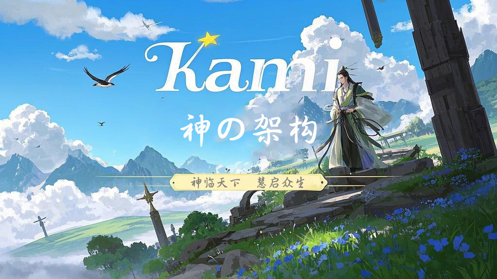

 
 
<h1 align="center">Kami 神の架构</h1>
<h2 align="center">🧚‍♂️神构万相，架筑非凡🕌</h2>
<h4 align="center">👩‍👩‍👧‍👦人 人 都 在 用 的 简 约 架 构⛩️</h4>
<h3 align="center">️点赞！⭐收藏！💬评论！🌟给个小星星！</h3>
<h3 align="center">☕请喝咖啡~</h3>

[博 客](https://jogjo.cn) |
[Q Q](https://qm.qq.com/q/YxdGW0bGYC) |
[微 信](https://u.wechat.com/EKFJ-MWA3mXm_UZSdcKBJjg?s=2)

遇见Kami，是神的旨意

 

# 介绍
kami 神の架构 ，是mvc架构的改进版，特点是整体结构清晰，可快速上手，适用于简单项目。

对于未来可能演化成微服务架构的项目，请参考【[kami-dom 神域架构](https://github.com/jogjo/kami)】

# 概念
“kami”通常指“神”或“神灵”，用于指代各种神灵或超自然存在，亦可以指代“我们”。

“架构”是一系列相关的抽象模式，用于指导软件系统各个方面的设计，是一个软件系统从整体到部分的最高层次的划分，是关于软件如何设计的重要决策。

“框架”是整个或部分系统的可重用设计，对特定应用领域中的应用系统的部分设计和实现。软件系统发展到今天已经很复杂了，特别是服务器端软件，涉及到的知识，内容，问题太多。在某些方面使用别人成熟的框架，就相当于让别人帮你完成一些基础工作，你只需要集中精力完成系统的业务逻辑设计。

框架技术和架构技术的出现，都是为了解决软件系统日益复杂所带来的困难而采取“分而治之”思维的结果。先大局后局部，就出现了架构；先通用后专用，就出现了框架。架构是问题的抽象解决方案，它关注大局而忽略细节；而框架是通用半成品，还必须根据具体需求进一步定制开发才能变成应用系统。

# 前言
先来感受一下传统的mvc开发架构

- com.xxx.abc
    - aop
    - config
    - constants
    - controller
    - dao
    - entity
    - enums
    - handle
    - service
      - impl
    - util
    - vo
- resource
  - mapper
    - xxx.xml
  - static
  - templates
  - application.yml

这是很原始的开发架构，像是材料工厂，他们其实是有层次的，但是只进行了简单的分类，难免让人觉得杂乱。

一般场景的调用链：
> 前端 templates > controller > service > dao > mapper > 数据库

# 正文
为了能让新人更友好的接触编程，我们能想到的有什么呢？

既然架构原本就有他的层次概念，那每个层次都应该有所体现，并且有一个合适、简洁、容易理解的含义。

**我们开始改造吧！**

## 前端大革命
什么是前端？其实网页端、手机端、桌面端、小程序，我们所能看到的，都可以看作前端。

好不好看是UI的事，关我们前端什么事！

既然前端方向如此之多，又自成体系，那么！

前端完全可以作为一个独立项目，脱离后端，成为新的kami！

于是前端就可以分化成很多个独立的kami

造神计划：
- kami-vue
- kami-react
- kami-uniapp
- kami-tauri
- ...（后续补上对应的链接）

一个后端kami，可以同时服务多个前端kami，合理！这很合理！

## 后端大调整
什么是后端？通常你看不见的脏活累活，都是交由后端处理并存储记录的，前端和后端通过各种接口进行交互。

那么，作为后端kami，也开始进行内部革命吧！

我们对层次结构进行重新划分

先这样！

然后那样！

就会得到这样的调用链：
> api > pow > mapper > 数据库

 纳尼！如此精悍！请往下继续看看是怎么个回事

### 梳理
- 概念的变更

> controller > api
>
> 控制 > 接口

> service > pow
>
> 服务 > 能力

> serviceImpl > powPro
>
> 服务实现 > 能力创造

- 分类的变更

> app 应用层

> pow 能力层

> pro 创造层

> res 资源层

### 整体结构
这里我们以java、maven项目为例，gradle、或者其他语言仅需参考概念

- .data 【应用数据存放目录】仅用于开发，生产环境需要修改目录
- .logs 【应用日志文件目录】
- bin 【打包脚本】 启动、停止、初始化脚本
- dev 【开发文件】
  - doc 【项目文档】
- src.main 【源代码目录】
  - java 【代码】
  - resource 【资源配置目录】
- .gitignore 【Git忽略文件配置】
- archetype.properties 【Maven骨架构建配置】
- assembly.xml 【自定义打包构建】
- LICENSE 【开源协议】
- pom.xml 【Maven配置】
- README.md 【介绍文档】

### 代码结构
- java
  - cn.jogjo.kami 【组织域】
    - app 【应用层】
      - api 【应用接口】
        - UserApi.java 【用户接口】
      - vo 【视图对象】
        - UserVO.java 【用户视图对象】
    - pow 【能力层】
      - UserPow.java 【用户能力接口】
    - pro 【创造层】
      - UserPowPro.java 【用户能力创造实现】
    - res 【资源层】
      - config 【配置】
        - SysConfig.java 【系统配置】
      - norm 【标准】 常量、枚举、统一规则
        - ActCode.java 【行为响应码】
        - ActResult.java 【行为响应结果】
      - oper 【操作员】 包含各种处理handler、processor、runner、filter、Interceptor
        - aop
          - PermissionCheck.java 【权限检测切片】
        - WebFilter.java 【网络过滤器】
        - WebInterceptor.java 【网络拦截器】
      - repo 【仓储】
        - cache 【缓存】
          - SysCache.java 【系统缓存】
        - mapper 【持久化映射器】
          - UserMapper.java 【用户持久化映射】
        - po 【持久化对象】
          - UserPO.java 【用户持久化对象】
      - task 【任务】 任务池、定时任务
        - SysTask.java
      - util 【工具】
        - I18nUtil.java 【国际化工具】
    - KamiApplication.java 【应用启动类】
- resource 【资源配置目录】
  - db 【数据库脚本】
    - h2 【h2数据库】
      - data.sql 【初始化数据脚本】
      - schema.sql 【数据库表结构脚本】
    - mysql 【mysql数据库】
  - i18n 【国际化】
    - messages 【信息资源】
      - messages.properties 【默认】
      - messages_en_US.properties 【英语】
      - messages_zh_CN.properties 【中文】
  - application.yml 【应用配置】
  - banner.txt 【应用启动标语】
  - logback-spring.xml 【日志配置】

# 结语
至此！

新的Kami已经出现

怎么能够停滞不前

穿越时空 竭尽全力

我会来到你身边！

层层递进，清晰简单，手搓小项目首选架构！

# 天神榜
感谢各位天神的馈赠！

<table>
  <tr>
    <td></td>
  </tr>
  <tr>
    <td align="center"><a href="https://jogjo.cn" title="这是JogJo的博客，走过路过不要错过哟~" target="_blank">JogJo</a></td>
  </tr>
  <tr>
    <td align="center">¥ 777</td>
  </tr>
</table>

# 贡献者
感谢各位大佬的贡献！

# 神の名录
感谢使用kami架构的用户、组织，欢迎留名！

<table>
  <tr>
    <td></td>
  </tr>
  <tr>
    <td align="center"><a href="https://jogjo.cn" title="这是JogJo的博客，走过路过不要错过哟~" target="_blank">JogJo</a></td>
  </tr>
</table>

# 互动交流
如果觉得kami架构符合你的使用需求和体验，请尽情使用！也欢迎留下你的项目链接，我们一起交流。

格式：
> 名称：JogJo
>
> 描述：这是JogJo的博客，走过路过不要错过哟~
>
> 链接：https://jogjo.cn
>
> 图片：可以是一个链接、或者具体图片

发送到邮箱：jogjo@qq.com

# 请作者喝咖啡

---

*你随手赞助的咖啡会让人兴奋得睡不着觉，一拍大腿！又出一个新功能！*

---

欢迎大家来博客反馈，在[树洞]可以匿名反馈，在[微聊]博主可以实时收到反馈消息，夜深人静的时候注意点，咳咳~

---